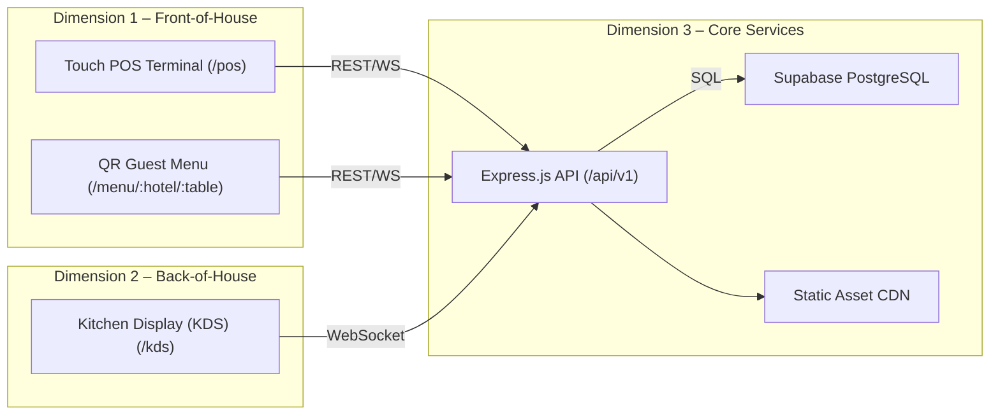
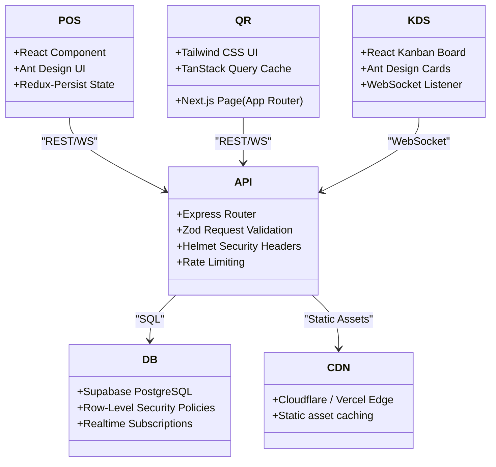
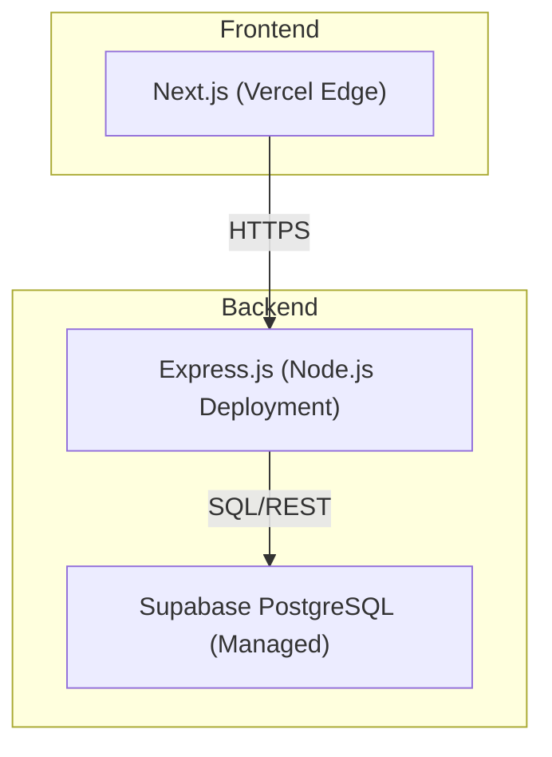
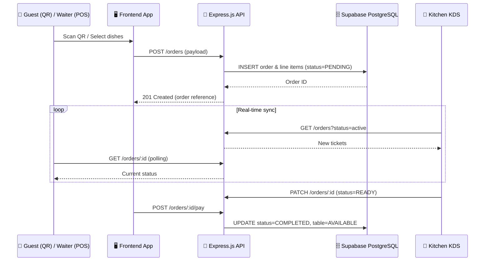

# 🍽️ Restaurant POS System – Full‑Stack Hotel & Restaurant POS + Contactless QR Menu

[](LICENSE)
[](https://nextjs.org/)
[](https://react.dev/)
[](https://www.typescriptlang.org/)
[](https://ant.design/)
[](https://tailwindcss.com/)
[](https://redux-toolkit.js.org/)
[](https://tanstack.com/query)
[](https://expressjs.com/)
[](https://supabase.com/)
[](https://github.com/Talalilyas1208/restaurant-pos-system/actions)

---

## 🌐 High‑Level 3‑Dimensional Architecture



---

## 🧩 Detailed Component Diagram



---

## 🚢 Deployment Architecture

### Docker‑Compose (local / dev)
```yaml
version: "3.9"
services:
  api:
    build: ./server
    ports:
      - "5001:5001"
    env_file: ./server/.env
    depends_on:
      - supabase
  client:
    build: ./client
    ports:
      - "3002:3000"
    environment:
      - NEXT_PUBLIC_API_URL=http://localhost:5001/api/v1
    depends_on:
      - api
  supabase:
    image: supabase/postgres:15
    ports:
      - "5432:5432"
    environment:
      POSTGRES_PASSWORD: supabase
      POSTGRES_DB: postgres
    volumes:
      - supabase-data:/var/lib/postgresql/data
volumes:
  supabase-data:
```

### Kubernetes (optional production)
> **Tip:** See the `k8s/` folder for ready‑made Helm charts.



---

## 🔄 End‑to‑End Order Lifecycle (Sequence Diagram)


---

## ⚡ Scalability & Performance
- **Horizontal API scaling** – Deploy multiple Express instances behind an NGINX/Traefik load balancer.
- **Caching** – TanStack Query cache on the client; optional Redis for server‑side session and rate‑limit storage.
- **CDN** – Serve static assets via Vercel Edge or Cloudflare.
- **Database** – Supabase read replicas; use connection pooling (pgbouncer) for high volume.
- **WebSocket scaling** – Pub/Sub broker (e.g., Redis Streams) to broadcast kitchen updates across API pods.
- **SSR/ISR** – Next.js Incremental Static Regeneration for menu pages.

---

## 🔐 Security Hardening Checklist
- **Authentication** – JWT from `/auth/login`, stored in HttpOnly Secure cookies.
- **Authorization** – Role‑based checks (cashier, manager, chef) in Express middlewares.
- **Helmet** – CSP, Referrer‑Policy, HSTS.
- **Supabase RLS** – Row‑level policies restrict data to the owning restaurant.
- **Input Validation** – Zod schemas for every request payload.
- **Rate Limiting** – `express-rate-limit` (10 req/s per IP).
- **OWASP Top 10** – Sanitize user input, strong password policy, CSRF protection for state‑changing endpoints.
- **Secrets Management** – `.env` excluded from repo; use GitHub Secrets or Vault in production.

---

## 📈 Observability & DevOps
- **Logging** – `pino` JSON logs to stdout (Docker‑compatible).
- **Tracing** – Optional OpenTelemetry integration.
- **Health Checks** – `/health` returns `{"status":"ok"}`; used for Kubernetes probes.
- **Metrics** – Prometheus metrics via `express-prometheus-middleware`.
- **CI/CD** – GitHub Actions builds client & server, runs lint & tests, deploys to Vercel/Render on merge.
- **Git Hooks** – `husky` pre‑commit linting and type‑checking.

---

## 🛠️ Best‑Practice Recommendations
- **Code Style** – Strict TypeScript (`strict:true`), ESLint (Airbnb) + Prettier.
- **Testing** – Jest unit tests, SuperTest integration tests, React Testing Library for UI, Cypress e2e.
- **Versioning** – SemVer; tag releases as `vMAJOR.MINOR.PATCH`.
- **Documentation** – API docs via `swagger-jsdoc`; generate markdown with `redoc-cli`.
- **Error Handling** – Central Express error middleware; user‑friendly toast messages on client.
- **Dependency Updates** – `dependabot` for automated upgrades.
- **Accessibility** – Ant Design components with ARIA labels; run a11y audits (Chrome DevTools).

---

## 🚀 Quick‑Start & Advanced Setup

### Environment Variables
| Variable | Description | Example |
|---|---|---|
| **NEXT_PUBLIC_API_URL** | Base URL for the backend API (client) | `http://localhost:5001/api/v1` |
| **PORT** | Express server port | `5001` |
| **SUPABASE_URL** | Supabase project URL | `https://xyz.supabase.co` |
| **SUPABASE_SERVICE_ROLE_KEY** | Service‑role secret (server only) | `******` |
| **JWT_SECRET** | Secret for signing JWTs | `supersecret` |
| **REDIS_URL** *(optional)* | Redis instance for caching / rate‑limit | `redis://localhost:6379` |

### Development
```bash
# Clone repo
git clone https://github.com/Talalilyas1208/restaurant-pos-system.git
cd restaurant-pos-system

# Backend setup
cd server && cp .env.example .env && npm ci && cd ..

# Frontend setup
cd client && cp .env.example .env && npm ci && cd ..

# Run with Docker Compose (recommended for local dev)
docker compose up -d

# Or run services locally
npm run dev:server   # inside server/
npm run dev:client   # inside client/
```

### Production
- Build Docker images (`docker build -t pos-api ./server` and `docker build -t pos-client ./client`).
- Deploy to Docker Swarm, Kubernetes, Render, Fly.io, etc.
- Terminate TLS at the load balancer.

---

## 🤝 Contributing
1. Fork the repository.
2. Create a feature branch (`git checkout -b feat/awesome‑feature`).
3. Install dependencies and run the full test suite (`npm test && npm run lint`).
4. Commit using **Conventional Commits**.
5. Open a PR – link the relevant issue and ensure CI passes.
6. Update documentation or diagrams when adding new components.

---

## 📄 License & Attribution
Distributed under the **MIT License**. See the `LICENSE` file for details.

---

## 📂 Repository Structure (quick links)
- **[client](file:///Users/mac/restaurant-management/client)** – Next.js frontend
- **[server](file:///Users/mac/restaurant-management/server)** – Express.js API
- **[supabase](file:///Users/mac/restaurant-management/supabase)** – DB schema & seed data
- **[docs/architecture.mermaid.md](file:///Users/mac/restaurant-management/docs/architecture.mermaid.md)** – Raw Mermaid source diagrams

---
