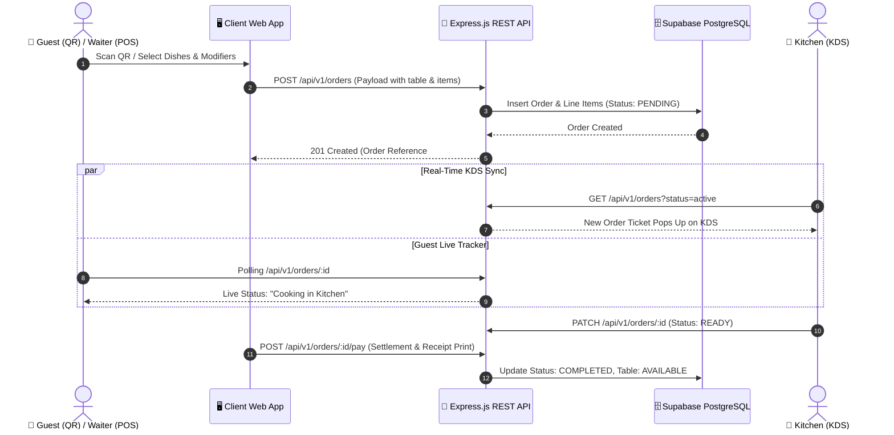

# 🍽️ Grand Horizon - Hotel & Restaurant POS & Contactless QR Menu System

[](https://nextjs.org/)
[](https://react.dev/)
[](https://www.typescriptlang.org/)
[](https://ant.design/)
[](https://tailwindcss.com/)
[](https://redux-toolkit.js.org/)
[](https://tanstack.com/query)
[](https://expressjs.com/)
[](https://supabase.com/)

A modern, production-ready, full-stack **Point of Sale (POS)**, **Kitchen Display System (KDS)**, and **Contactless QR Code Digital Menu** ecosystem built for fine-dining restaurants, hotel dining, cafes, and room service.

---

## 🧊 3D System Dimension Breakdown (3-Dimensional Architecture)

Grand Horizon is engineered across **3 interconnected operational dimensions**, ensuring synchronized data flow between diners, service staff, kitchen staff, and management in real time.

```
                      ┌──────────────────────────────────────────────┐
                      │        DIMENSION 1: FRONT-OF-HOUSE           │
                      │  • Touch POS Terminal  • Guest Mobile QR Menu│
                      │  • Modifiers & Splits  • 80mm Thermal Receipt│
                      └──────────────────────┬───────────────────────┘
                                             │
                                  Orders & Updates (REST / WS)
                                             │
                                             ▼
                      ┌──────────────────────────────────────────────┐
                      │         DIMENSION 2: BACK-OF-HOUSE           │
                      │  • Kitchen Display (KDS) Live Kanban         │
                      │  • Elapsed Prep Timers • Ticket State Sync   │
                      └──────────────────────┬───────────────────────┘
                                             │
                                  State & Status Updates
                                             │
                                             ▼
                      ┌──────────────────────────────────────────────┐
                      │    DIMENSION 3: DATA & MANAGEMENT CORE       │
                      │  • Express.js REST API • Supabase PostgreSQL │
                      │  • Redux-Persist Cache • QR Stand Generator  │
                      └──────────────────────────────────────────────┘
```

### 1️⃣ Dimension 1: Front-of-House (FoH) & Guest Experience
* **Touch-Optimized POS Terminal (`/pos`)**: High-speed touch catalog with category filters, fuzzy dish search, dish modifiers (doneness, toppings, extra sides), table occupancy mapping, split bills (2-to-6-way), multi-tender settlement (Cash, Card, Room Charge), and instant 80mm/58mm thermal receipt printing.
* **Contactless QR Guest Menu (`/menu/[hotelId]/[tableId]`)**: Zero-app-download mobile web menu automatically bound to the guest's table token. Includes dietary tags (Vegetarian, Spicy, Chef Special) and live visual order tracking (*Received* &rarr; *Cooking* &rarr; *Ready*).

### 2️⃣ Dimension 2: Back-of-House (BoH) & Kitchen Operations
* **Live Kitchen Display Kanban (`/kds`)**: Dynamic ticket columns (*New Tickets*, *Cooking On Line*, *Pass / Ready to Serve*) with single-click status progression.
* **Elapsed Prep Time Tracking**: Automated visual alert counters highlighting tickets over 15 minutes to eliminate food preparation bottlenecks.
* **Real-Time Polling & Invalidation**: TanStack React Query synchronization keeping kitchen screens continually synchronized with POS and QR orders.

### 3️⃣ Dimension 3: Data, Persistence & Cloud Management Core
* **Express.js API Layer**: Layered modular architecture (Controllers, Middlewares, Services, Zod schema validation, Helmet security).
* **Dual-Layer Persistence**: 
  - *Client State*: Redux Toolkit with `redux-persist` for offline cart preservation across tab reloads.
  - *Server State*: TanStack Query with localStorage sync persister for instant cache reads.
* **Supabase PostgreSQL & Admin Dashboard (`/admin`)**: Complete database schema with Row-Level Security (RLS), menu item availability toggle (86ing items), revenue analytics, and batch branded printable QR table stands.

---

## 🌟 Key Features Matrix

| Module | Core Functionality | Target Users | Key Technologies |
|---|---|---|---|
| **POS Terminal** | Touch ordering, table manager, bill splitting, payment processing, thermal receipts | Cashiers, Waiters, Captains | Next.js 14, Ant Design 5, Redux Persist |
| **QR Digital Menu** | Contactless dining, dietary filters, live order tracker | Restaurant Guests, Room Service | Next.js App Router, Tailwind CSS, Lucide |
| **Kitchen KDS** | Kanban ticket workflow, prep time warnings, status sync | Chefs, Line Cooks, Expeditors | TanStack Query v5, Ant Design Cards |
| **Admin Hub** | Printable table QR generator, menu & price editor, revenue analytics | Managers, Owners, Accountants | Ant Design Charts, `qrcode.react`, Supabase |

---

## 🔄 End-to-End Order Lifecycle Flow



---

## 📂 Project Directory Structure

```text
restaurant-management/
├── client/                               # Next.js 14+ App Router Frontend
│   ├── src/
│   │   ├── app/
│   │   │   ├── layout.tsx                # Global AntD Registry & Redux/Query Providers
│   │   │   ├── page.tsx                  # Workspace Role Selection Hub
│   │   │   ├── pos/page.tsx              # Touch POS Cashier & Table Terminal
│   │   │   ├── menu/[hotelId]/[tableId]/ # Contactless Guest QR Menu & Tracker
│   │   │   ├── kds/page.tsx              # Kitchen Display Kanban System
│   │   │   └── admin/page.tsx            # Admin Operations & QR Stand Cards
│   │   ├── components/                   # Modal dialogs, Receipt formatters, QR stands
│   │   ├── store/                        # Redux Toolkit slices (Cart, Auth, Table)
│   │   ├── lib/                          # TanStack Query persister & API client
│   │   └── types/                        # TypeScript domain interfaces
├── server/                               # Express.js REST API Backend
│   ├── src/
│   │   ├── config/                       # Supabase client & environment loader
│   │   ├── controllers/                  # Order, Menu, Table, Analytics controllers
│   │   ├── middlewares/                  # Zod validation & central error handler
│   │   ├── routes/                       # REST routes (/api/v1/...)
│   │   ├── services/                     # PostgreSQL service & in-memory fallback
│   │   └── server.ts                     # Express application bootstrap
├── supabase/
│   ├── schema.sql                        # Database tables, relationships, RLS policies
│   └── seed.sql                          # Demo restaurant tables, categories, dishes
├── package.json                          # Monorepo workspace runner scripts
└── README.md
```

---

## 🚀 Getting Started

### 1. Prerequisites
* **Node.js**: v18.0.0 or higher
* **npm**, **pnpm**, or **yarn**

### 2. Installation & Setup

Clone the repository and install dependencies:

```bash
git clone https://github.com/Talalilyas1208/restaurant-pos-system.git
cd restaurant-pos-system

# Install backend dependencies
cd server && npm install

# Install frontend dependencies
cd ../client && npm install
cd ..
```

### 3. Run Development Environment

From the project root:

```bash
# Start backend Express server (Port 5001)
npm run dev:server

# In a separate terminal, start frontend Next.js app (Port 3002 / 3000)
npm run dev:client
```

* **Frontend Application**: [http://localhost:3002](http://localhost:3002) (or `localhost:3000`)
* **Backend API Base**: [http://localhost:5001/api/v1](http://localhost:5001/api/v1)
* **Health Check**: [http://localhost:5001/health](http://localhost:5001/health)

---

## 🗄️ Database & Supabase Integration (Optional)

The backend features an **automatic in-memory fallback store**, meaning the entire platform runs out-of-the-box for local testing without database credentials.

To connect to a live Supabase PostgreSQL instance:
1. Create a database on [supabase.com](https://supabase.com).
2. Execute `supabase/schema.sql` in the Supabase SQL Editor.
3. Execute `supabase/seed.sql` to populate sample menu items and table configurations.
4. Set your environment variables in `server/.env`:
   ```env
   PORT=5001
   SUPABASE_URL=https://your-project.supabase.co
   SUPABASE_SERVICE_ROLE_KEY=your-supabase-service-role-key
   ```

---

## 📄 License & Attribution

Distributed under the **MIT License**. Engineered for high-throughput hospitality businesses, restaurants, and hotels.